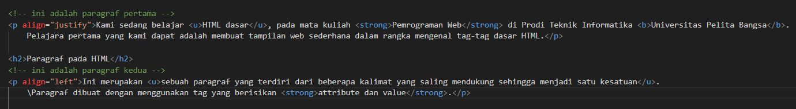

# Lab1Web

## Nim: 312410382
## Nama: Bagus aditya hermawan
## Kelas: TI.24.A3
## Mata kuliah: Pemrograman Web 1

## Langkah-langkah Pengerjaan HTML

1. Membuat Dasar File HTML.

2. Membuat Judul Website

3. Membuat Isi Konten Berupa Paragraf 
Paragraf:

Isi:

4. Menambahkan Judul

5. Memformat Teks
Format:

Contoh:

6. Menambahkan Gambar
Tag dan contoh:

Hasil gambar:

7. Menambahkan Hyperlink
Tag, atribut, dan contoh:

Hail:

## Hasil Praktikum
VSC:

Halaman Eksternal:

### Pertanyaan
1. Adakah error ketika terjadi kesalahan penulisan tag?

2. Apa perbedaan tag 
 dengan  ?

3. Apa perbedaan atribut title dan alt pada tag ?

4. Agar proporsional, sebaiknya atribut width dan height diisi semua atau tidak? Jelaskan.

5. Apa perbedaan atribut target dengan nilai _blank, _self, _top, dan _parent?

Jawaban
1. Untuk kode tidak ada yang terjadi error ketika saya mencoba beberapa tag html. tapi untuk image ketika saya menaruh di folder yang berbeda masih suka terjadi error yaitu gambarnya tidak muncul.

2. Tag 
 berfungsi untuk memuat paragraf yang berisikan kata-kata atau kalimat. sedangkan tag   berfungsi untuk membuat baris baru dalam setiap paragraf.

3. kalau atribut tittle berfungsi sebagai informasi tambahan pas ketika kursor diarahkan ke suatu elemen maka akan muncul namanya. sedangkan atribut alt itu sebagai pengganti ketika gambar yang dimasukkan tidak muncul. maka alt akan menampilkan kalimat yang sudah dibuat sebagai penganti logo yang tidak muncul.

4. Menurut saya lebih baik pilih salah satu saja dikarenakan agar ukuran dari lebar dan tingginya tetap sama. sebenarnya untuk pilih keduannya juga bisa namun ukuran lebar dan tingginya harus dikalkulasikan terlebih dahulu agar tidak ada yang terlebih.

5. Atribut target itu untuk nentuin dimana link tersebut dibuka. Untuk nilai _self akan terjadi terbukanya link dengan tab yang sama. nilai _blank terjadi ketika link di klik maka akan terbuka di tab baru. nilai _parent akan terjadi ketika link di klik maka akan mengikuti penelusuran induk. nilai _top akan terjadi ketika link di klik maka akan terbuka di tab yang sama tapi semuanya akan terhapus atau ganti ke isi yang lain.